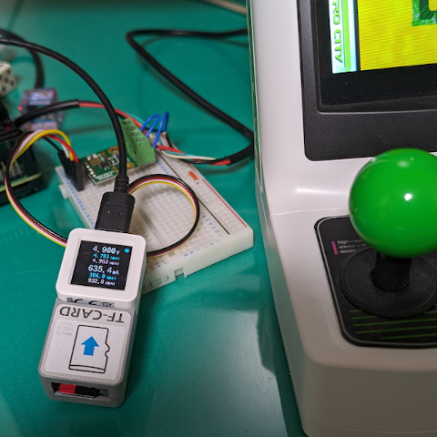

# M5 AtomS3用電力測定アプリケーション

## 概要


AtomS3とStrawberry Linuxで販売されている[INA226PRC](https://strawberry-linux.com/catalog/items?code=12226)を用いて直流用の電力モニタを行うアプリケーションです。

AtomS3にTFカードリーダが接続されている場合は、SDカードに計測結果を記録することが可能です(サンプリングレートは1KHz)。TFカードリーダが接続されていない場合は計測のみ可能です。SDカードは16GまでのSD/SDHCに対応しています。

## 接続
AtomS3と周辺機器は以下の様に接続してください。


## 構成
ディレクトリ構成は以下のようになっています。

- atoms3<br>AtomS3用のソースコードが格納されています
- converter<br>AtomS3でSDカードに保存したデータをCSVに変換するコンバータ。Rustで記述されています。

## AtomS3の操作
### ボタン操作
SDカードに書き込み可能な場合は、ボタンA(LCD画面)の長押しで記録の開始・終了を切り替えます(書き込み中は画面右上のマーカーが赤色に変わります)。
ボタンAのダブルクリックで保持している最小･最大値をクリアします。

### タイムスタンプ対応
データ記録用SDカードのルートディレクトリにap\_info.txtというファイルを作成し、WiFiアクセスポイントのアクセス情報を記述しておくとNTPで時刻合わせを行いタイムスタンプが正しく付与されるようになります。また保存ファイルのファイル名に記録開始時刻を埋め込むようになります。
ap\_info.txtはテキストファイルで以下の様に記述してください。

```
FS030W_P65847
5xxxxxx8
```

1行目にアクセスポイントのSSIDを、2行目にパスワードを記述してください。双方共に文字列形式のみでヘキサ形式での記述は受け付けていません。
NTPサーバはプライマリにntp.nict.jpを、セカンダリにntp.jst.mfeed.ad.jpを使用します。なお、NTPによる時刻調整は起動時にのみ行います。

## コンバータの使用方法
AtomS3で保存したファイルをCSVに変換します。このときファイル名に以下の形式で記録開始時刻が埋め込まれている場合、CSVタイムスタンプの調整を行いミリ秒単位でのUNIX時刻に変換します(ファイル名に時刻情報が埋め込まれていない場合のタイムスタンプはは記録開始からのミリ秒単位の経過時間となります。)。

CSVの列構成はタイムスタンプ/電圧値(V)/電流値(mA)となります。

コマンドラインオプションは以下を参考にしてください。

```
Converter for DC power logger

Usage: converter [OPTIONS] <INPUT_FILE>

Arguments:
  <INPUT_FILE>  input file name

Options:
  -o, --output <FILE>         Set output file name
  -t, --timezone <ZONE-NAME>  Set applicable time zone [default: Asia/Tokyo]
  -h, --help                  Print help
  -V, --version               Print version
```
